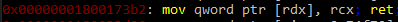

# **Summary**
One of the many tricks in the red-teamer's arsenal is [process injection](https://attack.mitre.org/techniques/T1055/ "Process Injection"). This technique is leveraged to get code to run in the address space of another process. There are multiple reasons as to why this would be desirable when attacking a computer or network. Among other things it can be used to bypass whitelisting, evade detection and increase stealthiness. This technique, however, is widely used and therefore widely known. Most of the decent antivirus and EDR-solutions have detection rules in place to stop injection from taking place. This post will introduce a new way of reaching succesful injection without it getting detected or stopped.

## How does AV/EDR detect process injection?
Most of the injection techniques follow the same basic structure: allocating memory in the target process ([VirtualAllocEx](https://docs.microsoft.com/en-us/windows/win32/api/memoryapi/nf-memoryapi-virtualallocex "VirtualAllocEx"), [NtMapViewOfSection](http://undocumented.ntinternals.net/UserMode/Undocumented%20Functions/NT%20Objects/Section/NtMapViewOfSection.html "NtMapViewOfSection")), writing data to the allocated memory ([WriteProcessMemory](https://docs.microsoft.com/en-us/windows/win32/api/memoryapi/nf-memoryapi-writeprocessmemory "WriteProcessMemory")) and executing the written memory ([APC](https://docs.microsoft.com/en-us/windows/win32/sync/asynchronous-procedure-calls "APC"), [CreateRemoteThread](https://docs.microsoft.com/en-us/windows/win32/api/processthreadsapi/nf-processthreadsapi-createremotethread "CreateRemoteThread"), Thread Hijacking). Because this order of steps is very common, it is relatively easy for the blue team (along with AV/EDR) to create rules that catch this behavior. Most of the time the first two steps are already enough to get caught.

# **Methods of process injection**
We will take a look at how process injection can be achieved, and see what it can get caught on. In the following example, a valid handle to the target process with access rights set to ALL_ACCESS is already obtained.

First, we need to allocate memory in the target process:

```cpp
VirtualAllocEx(hProcess, nullptr, size + 1, MEM_RESERVE | MEM_COMMIT, PAGE_READWRITE);
```

The above call will allocate a piece of memory in the target process with the size of our payload and lets us read and write to it. An extra byte is added to the size to account for an appended nullbyte when writing strings.

After having allocated the memory we want to write our payload to it, which can be done by calling the following function:

```cpp
WriteProcessMemory(hProcess, buffer, payload, size, nullptr);
```

We now have to think about what we have injected: is it actual code, or is it a path to a DLL on disk? If it is the former, we have to let the process load that DLL, which can be done with creating a thread with the entrypoint pointed to LoadLibrary, and with a pointer to the written buffer as argument. If it is the latter, we can create a thread with the entrypoint set to the start of our buffer. Keep in mind that for us to be able to execute our payload, we need execution rights on that piece of memory. This can be obtained by either calling [VirtualProtectEx](https://docs.microsoft.com/en-us/windows/win32/api/memoryapi/nf-memoryapi-virtualprotectex "VirtualProtectEx") after allocation, or at the point of allocation. A little warning, though: AV does not like it when you allocate R+W+X memory in another process, so your best bet is to allocate with read/write, and later change it to read/execute.

Creating a thread is very easy and can be done by calling the following:

```cpp
CreateRemoteThread(hProcess, nullptr, 0, buffer, nullptr, 0, nullptr);
```

Of course, it is important to check the returnvalues of the aforementioned functions.

Other ways of process injection follow the above behaviour closely, but mostly differ by the way of executing the buffer (creating a thread, using an existing thread or using APC calls). 

What we want to achieve, however, is change the way of writing our payload into the buffer, so we can switch up the standard behavior and (hopefully) get past any detection mechanisms in place.

# **The method**
We want to eliminate the call to WriteProcessMemory, but also know that [atombombing](https://blog.ensilo.com/atombombing-brand-new-code-injection-for-windows "atombombing") is already detected. What we came up might be a little more intrusive than atombombing, but was something that many have might not thought of, or heard about before. The idea is pretty straight forward and easy to understand, even if you might not know the ins and outs of Windows, threads and the assembly language.

The idea is to utilize a [ropchain](https://en.wikipedia.org/wiki/Return-oriented_programming "ropchain") in the target process to write the value of a register into a buffer. If you do not know what a ropchain (or ropchaining) is, we highly recommend you look it up before you continue reading. What we are looking for is an assembly instruction that writes the value of a register to a dereferenced register (a pointer to our buffer).

Using a great tool called [Ropper](https://github.com/sashs/Ropper "Ropper") you can easily search for the needed gadgets, for example using the following command results in a gadget we can use:

```bash
ropper --file "C:/Windows/System32/kernel32.dll" --search "mov [%], %; ret" --quality 1
```
```
mov qword ptr [rdx], rcx
ret
```
<!--  -->

In the above instruction the value of `rcx` gets moved into wherever `rdx` is pointing to. After, it will return into whatever address is on top of the stack.
When attempting this method for the first time, we allocated a stack and set the stack pointer to point to it. This worked, however it's very impractical. A `push` instruction before the `mov` will help us out drastically. This way, if we place the address of our target instruction in this register, it gets pushed to the top of the stack. Now `ret` will return into our specified address.

Using ropper, we can search for a new gadget:
```bash
ropper --file "C:/Windows/System32/kernel32.dll" --search "push %; mov [%], %; ret"
```
The above command finds a few gadgets we can use. For this example we will use the following instructions located at offset `0x00000001800016be`:
```
push rax
mov qword ptr [r8 + 0x50], rcx
ret
```

The next problem we faced is where to return into. The first guess was to return into the [ExitThread](https://docs.microsoft.com/en-us/windows/win32/api/processthreadsapi/nf-processthreadsapi-exitthread "ExitThread") function, however this did not seem to work (because of register values) and would only be viable if we were not reusing the thread later on. The next call we used was [SleepEx](https://docs.microsoft.com/en-us/windows/win32/api/synchapi/nf-synchapi-sleepex "SleepEx"). Because of the [calling convention of x64](https://docs.microsoft.com/en-us/cpp/build/x64-calling-convention "Calling convention of x64"), `rcx` would be our time to sleep, which would be extremely long if it was holding the value of our buffer. This worked, however the thread did not want to wake up anymore. Making the thread wait was mandatory, though, so why not create and infinite loop ourselves? We can achieve this by pushing an address to the stack which contained a `jmp` instruction to the same register we were pushing (in this case `rax`). 
What should happen is that `rax` gets pushed to the stack, part of our data gets copied to the buffer and it returns into the `jmp rax` instruction. However, rax is never cleared, so it is still pointing to `jmp rax` and therefore jumps to itself, and this goes on forever. 

Now having successfully made the thread wait for us to give it new data, we can do so in a loop, with each time writing the amount of bytes that will fit in our register (on x64 this is 8 bytes).

One catch, however, is that this takes time. A lot of time. This is because the thread will be writing part of the buffer `size / 8` times, and each iteration you have to wait to account for overhead.

Here is an example of what a loop for the iterations could look like

```cpp
for (int i = 0; i < size;) {

    /* zero the buffer */
    memset(&buf, 0, sizeof(buf));
   
    /* suspend the thread stuck in the infinite loop */
    SuspendThread(thread);

    /* copy part of the payload into buffer */
    memcpy(buf, (char*)local_buf + i, min(8, size - i));

    /*  set registers of thread */
    ctx.Rip = (uint64_t)gadget;     //address of our gadget
    ctx.Rax = (uint64_t)loop;       //address of our loop

    /* subtract 0x50 from address. The gadget will add it back */
    ctx.R8 = (uint64_t)((uint64_t)ptr + i) - 0x50;
    memcpy(&ctx.Rcx, buf, 8);

    std::this_thread::sleep_for(DELAY);

    /* Set the registers of the thread */
    if (!SetThreadContext(thread, (CONTEXT*)&ctx)) {
        CloseHandle(thread);
        thread = get_thread(_hProc);
        continue;
    }

    std::this_thread::sleep_for(DELAY);

    /* Resume the thread */
    while (ResumeThread(thread) != 1);

    std::this_thread::sleep_for(DELAY);

    /* increment value by size of register */
    i += sizeof(uintptr_t);
}
```

Play around with the `DELAY` and find a good value that works for you.

The final part is executing our payload. As said before, this can either be a path to a DLL, or actual shellcode. Getting the dll loaded is not any harder than we have already been doing. All we have to do is set the instruction pointer to the start of [LoadLibrary](https://docs.microsoft.com/en-us/windows/win32/api/libloaderapi/nf-libloaderapi-loadlibrarya "LoadLibraryA") with our argument (`rcx`) being a pointer to the start of our (now written) buffer.

An added bonus when injecting a DLL is that we don't need a big buffer to write our path into (`"C:\Temp\evil.dll"`, or maybe even `"C:\evil.dll"`) and does not have to be placed in executable memory. This means that we can also look for locations in a module that we have read and write access to. Doing this will eliminate the call to allocate memory, leaving us only with calls to interact with the thread.

## getting rid of memory allocations
Lets do what the above suggests. We can achieve this by using an unused piece of memory in the target process (a so called [codecave](https://en.wikipedia.org/wiki/Code_cave "codecave")). This memory has to be writable when mapped, though (this is no PE infection). Looking at the segments using a debugger, we can see the segments and their protection:
<br><br>

<br><br>
Only the `.data` segment has the writable flag set on it's memory, and so this is the one we can (and will) use. Looking for a codecave is pretty trivial, and won't be covered in this blogpost. Just make sure that you are searching for one in memory you can write to. A little trick you can use is searching for a codecave in either kernel32 or ntdll, since these are mapped at the same addresses across processes. This allows you to search for a codecave locally, and use the same found codecave address as the target buffer. 
<br>
We now have eliminated the need to allocate memory, and thus removed one more syscall we can get flagged on!

# **Results**
Testing this method against the following AV's\EDR yielded promising results. Not one of the following products flagged, or stopped the injector:
```
1. Avira
2. AVG
3. Avast
4. Eset
5. Malwarebytes
6. Microsoft ATP
```

# **Detection methods**
This injector still makes some calls that can be flagged as malicious, like opening a thread and interacting with it (getting/setting the context and suspending/resuming the thread). Detecting this method would require manifacturers to write signatures to catch this behavior.

# **final thoughts**
It was fun to mess around with the threads and to overcome the many hurdles that got in the way, especially after seeing the injector working as intended. This shows that you can always find new ways to achieve what you want, all you have to do is think out of the box a little once in a while. I want to give many thanks to my colleague Rick Veldhoven for helping me out when things got tough.